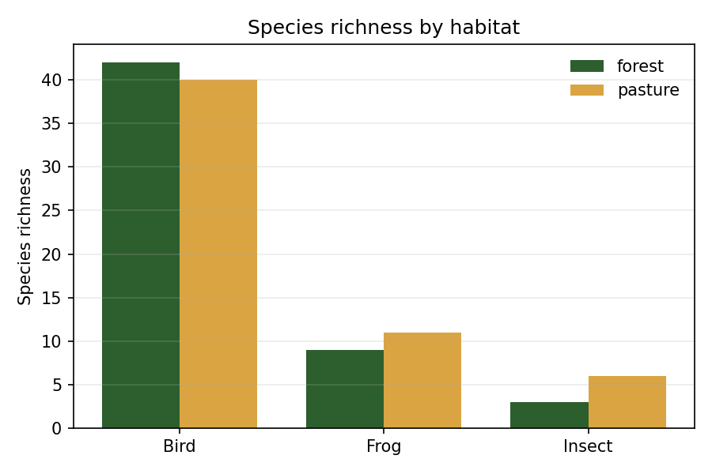
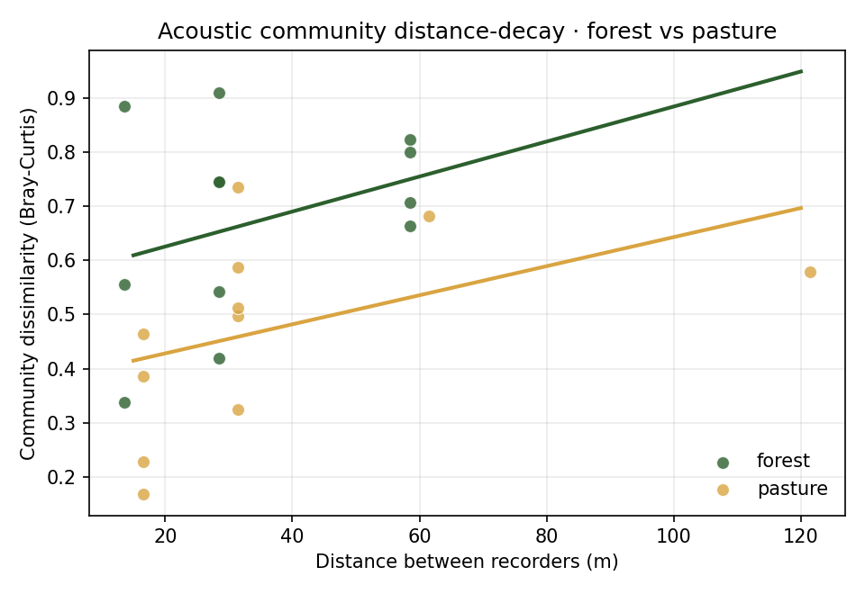
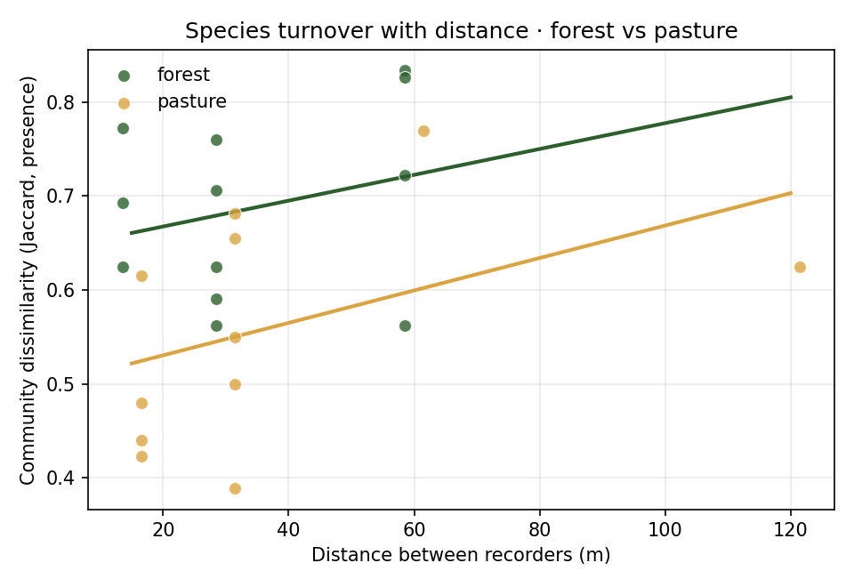

# How far apart should acoustic recorders be? A species-community test of recorder spacing in forest and pasture at Tandayapa

*Tandayapa Cloud Forest Station, Ecuador · passive acoustic monitoring with AudioMoth · field-research course report*

> Draft generated 2026-06-10. Numbers and figures come from `analysis/biodiversity_distance_decay.py`; the reproducible R pipeline is `analysis/biodiversity_distance_decay.R`. BirdNET detections were expert-reviewed; three false-positive frog taxa were removed (`data/excluded_frog_taxa.csv`).

---

## 1. Introduction

Passive acoustic monitoring (PAM) with low-cost recorders such as AudioMoth is now a standard tool for surveying soniferous biodiversity — birds, frogs, and insects — over long periods and with minimal disturbance. A practical question that any PAM study must answer, but rarely tests directly, is **how far apart recorders should be placed**. If two recorders sit close together they "hear" almost the same animals and act as one sample (pseudoreplication); if they are far apart they capture independent slices of the community and provide genuine spatial replication. The right spacing depends on how quickly the recorded community changes with distance — and that, in turn, should depend on the habitat, because vegetation and terrain control how far sound travels.

Tandayapa Cloud Forest Station spans a mosaic of dense forest and open pasture, an ideal contrast for asking whether recorder spacing "behaves" differently between a structurally complex habitat and an open one. Rather than relying only on summary acoustic indices, we use the **species community itself** — the set and relative activity of species detected by an automated classifier (BirdNET) — as the response, because community turnover is the quantity a biodiversity study actually cares about.

## 2. Research question

**How does the similarity of the acoustic species community recorded by two AudioMoths change with the distance between them, and is that distance–community relationship different in forest than in pasture?**

## 3. Mechanism

Sound attenuates and scatters as it travels, so each recorder effectively samples the animals within a limited "listening area." Two recorders whose listening areas overlap strongly detect a similar community; as they move apart, their listening areas overlap less and they increasingly sample different individuals, microhabitats, and species — so the **community recorded becomes progressively more dissimilar with distance** (a *distance-decay of community similarity*, the acoustic analogue of distance-decay in community ecology).

Habitat structure modulates this. In **forest**, vegetation and terrain absorb and scatter high-frequency sound and block line-of-sight, so each recorder hears a *smaller* area and the soundscape is more spatially patchy. In open **pasture**, sound carries farther with less obstruction, so recorders hear a *larger*, more homogeneous area. The mechanistic expectation is therefore that **community dissimilarity should rise faster with distance in forest than in pasture** — i.e., forest recorders become "independent" over shorter distances.

## 4. Hypotheses and predictions

- **H1 — Distance-decay.** Community dissimilarity between two recorders increases with the distance between them.
  - *P1:* Pairwise Bray–Curtis and Jaccard dissimilarity increase with inter-recorder distance.
- **H2 — Habitat modulates the decay (key hypothesis).** The increase is steeper in forest than in pasture, because forest attenuates sound and creates more localized soundscapes.
  - *P2:* The distance × habitat interaction is positive — the forest slope of dissimilarity-vs-distance is greater than the pasture slope.
- **H3 (descriptive).** Because the design contrasts habitats, overall species richness may differ between forest and pasture.
  - *P3:* Forest and pasture differ in detected species richness (direction not predicted a priori).

## 5. Methods

### 5.1 Study site and sampling design
Recorders were deployed along short linear transects ~20 m inside the forest edge and in adjacent open pasture at Tandayapa (≈1640–1710 m elevation; GPS waypoints in `data/tandayapa_gps_waypoints.csv`). Each deployment placed **three recorders per habitat** at equally spaced points (point 1–2–3) on the line. The **spacing between adjacent points was changed between deployment days** so that the same linear design was sampled at three distances:

| Spacing | Deploy days | Adjacent-point distance | End-point distance |
|--------:|-------------|------------------------:|-------------------:|
| 15 m    | day1, day4  | 15 m                    | 30 m               |
| 30 m    | day2, day5  | 30 m                    | 60 m               |
| 60 m    | day3, day6  | 60 m                    | 120 m              |

Because each point can be compared with two others, a single deployment yields inter-recorder distances of *spacing* and *2 × spacing*; across all days the design samples **15, 30, 60, and 120 m**.

### 5.2 Replication
Two levels of replication are built in, as required:
1. **Replicate deployments per spacing.** Each spacing (15/30/60 m) was deployed on **two separate days** (e.g., 15 m on day1 and day4). The deploy day is therefore a **replicate block**, allowing the distance effect to be estimated *within* days and generalized *across* them.
2. **Multiple recorder pairs per deployment.** Each 3-recorder line yields up to 3 within-habitat pairs.

The pairwise unit is a *recorder pair*; pairs within a deployment share recorders and are **not fully independent**. We therefore (a) include **deploy day as a random intercept** in the formal model (`(1 | deploy)`, R/`lme4`), and (b) use **permutation tests** for inference, which do not assume independence the way ordinary parametric tests do. Some recorders failed (dead SD cards / mis-set USB mode), so a few deployments contributed fewer than three points. This is a **methodological pilot** with small *n*, and we treat it as such.

### 5.3 Detection data and cleaning
Species detections came from the project's automated pipeline: **BirdNET** for birds (range-filtered to species plausible at the site) and insects, and a frog classifier for anurans, each verifiable by ear and spectrogram in the project web app. We kept detections with confidence **≥ 0.25** (the threshold at which taxa were visually/aurally validated). Following expert review, **three frog taxa were removed as false positives** — *Pipa pipa*, *Sachatamia orejuela*, *Teratohyla pulveratum* (516 detections; `data/excluded_frog_taxa.csv*`). Insects were confirmed reliable and retained. (*Teratohyla midas*, 33 detections, was not part of the validated set and is flagged but retained; excluding it does not change the conclusions.)

### 5.4 Community and dissimilarity metrics
For each recorder in each deployment we built a **species × detection-count vector** (detection count as an index of vocal activity / acoustic abundance). For every within-habitat recorder pair we computed two community dissimilarities:
- **Bray–Curtis** on detection abundance (sensitive to how much each species is detected);
- **Jaccard** on presence/absence (species turnover only).

### 5.5 Statistical analysis
The response (Bray–Curtis or Jaccard dissimilarity) was modelled against **inter-recorder distance**, **habitat**, and their **interaction**. The reproducible formal model is a linear mixed model `dissimilarity ~ distance × habitat + (1 | deploy)` (R, `lme4`/`lmerTest`).

Following the course emphasis on **effect sizes rather than p-values**, we report each distance effect as an **effect size with a 95% confidence interval**: the **slope of dissimilarity vs distance (Δ dissimilarity per +10 m)**, its **95% CI**, the **R²** (variance in dissimilarity explained by distance), and the **standardized slope** (per 1 SD of distance). The test of H2 is reported as the **forest − pasture difference in slopes with its 95% CI** — if that interval excludes zero, the habitats differ in decay rate. Permutation p-values (5 000 permutations) are reported only secondarily, in parentheses. Analyses were run in Python (`.venv-perch`, pandas/scipy/matplotlib) and reproduced in R; code in `analysis/` (`effect_sizes.csv`).

## 6. Results

**Data retained.** 16,235 detections (confidence ≥ 0.25) across **29 recorder-deployments**, yielding **23 within-habitat recorder pairs** (12 forest, 11 pasture) at distances of 15, 30, 60, and 120 m.

### 6.1 Species richness (descriptive)
Detected richness was **nearly identical** between habitats, both overall and within each taxonomic group:

| Habitat | Birds | Frogs | Insects | **Total** |
|---------|------:|------:|--------:|----------:|
| Forest  | 67    | 14    | 6       | **87**    |
| Pasture | 66    | 16    | 7       | **89**    |

So the two habitats are not separated by *how many* species are present, but potentially by *how the community is organized in space* — which is what the spacing analysis tests.

### 6.2 Distance-decay of community similarity (H1)
Community dissimilarity **increased with inter-recorder distance** for both metrics and both habitats — recorders placed farther apart recorded more different communities (supporting **P1**). Reported as effect sizes:

| Response | Habitat | **Δ dissim per +10 m** (effect size) | **95% CI** | **R²** | std. β | (perm *p*) |
|----------|---------|------------------:|:----------------:|----:|----:|----:|
| Bray–Curtis | Forest  | **+0.044** | (−0.008, +0.095) | 0.26 | 0.51 | 0.095 |
| Bray–Curtis | Pasture | +0.019 | (−0.016, +0.054) | 0.14 | 0.38 | 0.263 |
| Jaccard     | Forest  | **+0.029** | **(+0.006, +0.051)** | **0.45** | 0.67 | 0.022 |
| Jaccard     | Pasture | +0.018 | **(+0.002, +0.034)** | **0.42** | 0.65 | 0.062 |

The effect is clearest and largest for **species turnover (Jaccard)**: a **moderate-to-large effect** (R² ≈ 0.42–0.45; standardized slopes ≈ 0.65–0.67), with **95% CIs that exclude zero in both habitats** — i.e., distance reliably increases species turnover. The abundance-based Bray–Curtis shows the same positive direction with a comparable forest effect size (R² = 0.26) but **wider CIs that include zero**, so it is less certain at this sample size. As a benchmark, a Jaccard slope of +0.029 per 10 m implies recorders ~100 m apart share on the order of ~30% fewer species than adjacent ones.

### 6.3 Does habitat change the decay rate? (H2 — key test)
The effect size for H2 is the **forest − pasture difference in slopes**. Forest slopes were numerically steeper for both metrics, **as predicted** — but the difference is **small and its 95% CI includes zero**:

| Response | Forest − pasture slope diff per +10 m (H2 effect size) | **95% CI** | (perm *p*) |
|----------|----------------------------:|:----------------:|----:|
| Bray–Curtis | +0.025 | (−0.034, +0.084) | 0.88 |
| Jaccard     | +0.011 | (−0.016, +0.037) | 0.96 |

So **H2 is not supported by this pilot**: the point estimates lean in the predicted direction (forest decaying faster), but the effect-size interval comfortably spans zero, so the data cannot distinguish the forest and pasture decay rates. For Jaccard, the difference (+0.011/+10 m) is also small *relative to* the within-habitat slopes (~+0.02–0.03/+10 m) — even if real, it is a minor modulation, not a large habitat contrast.

## 7. Discussion

**Recorders do sample increasingly different communities as they are spaced farther apart**, confirming the core premise that spacing controls sample independence (H1/P1). The signal is strongest for **species turnover (Jaccard)**: by ~60–120 m, forest recorder pairs shared noticeably fewer species than adjacent ones. Practically, this means that for a biodiversity inventory at Tandayapa, recorders placed only ~15 m apart are partly redundant, whereas spacing on the order of tens of metres begins to buy genuinely new community information.

The **key ecological hypothesis — that forest attenuates sound and therefore decays faster than pasture (H2)** — was *directionally* supported (every forest slope exceeded its pasture counterpart) but its **effect size was small with a 95% CI spanning zero** (Jaccard difference +0.011 per +10 m, CI −0.016 to +0.037). Two readings are consistent with the data: (i) the true habitat difference is small relative to the within-habitat decay, or (ii) there is a real but modest difference that this pilot is underpowered to resolve. With only 11–12 pairs per habitat and 2 replicate days per spacing, the slope-difference estimate is imprecise, and several recorder failures further thinned the design.

That **richness was essentially identical** (87 vs 89 species) is itself informative: forest and pasture at this site host comparably rich soniferous communities, so any methodological difference between them is about **spatial structure**, not species count — exactly the axis the spacing design targets.

**Limitations.** (1) Small *n* and recorder failures limit power, especially for the interaction. (2) Recorder pairs within a deployment are not independent; we mitigated this with a deploy random effect and permutation inference, but residual pseudoreplication remains. (3) Detection counts index vocal *activity*, not abundance, and BirdNET reliability varies by group (birds strong; frogs good after the false-positive removal; insects validated here but coarse in general). (4) We used nominal spacing; real GPS distances (provided) deviate slightly and could be substituted as a robustness check.

## 8. Conclusion

At Tandayapa, the acoustic species community recorded by two AudioMoths becomes **measurably more different as the recorders are spaced farther apart** — a distance-decay that is clearest as species turnover and is already detectable across 15–120 m. Forest tended to decay faster than pasture, **as hypothesized**, but this pilot **could not confirm a habitat difference statistically**. The headline practical recommendation is that **recorder spacing materially affects sample independence and should be reported and standardized** in PAM designs; the headline scientific next step is a **larger, balanced deployment** (more replicate days, no recorder gaps, finer distance steps) to test whether the forest-steeper-decay effect is real. The biodiversity-based, community-turnover framing used here is the appropriate currency for that test, and the analysis pipeline (`analysis/`) is now reproducible end-to-end.

---

### Reproducibility
- Analysis (Python): `analysis/biodiversity_distance_decay.py` → `outputs/analysis/` (figures, `pairwise_dissimilarity.csv`, `richness_by_habitat.csv`, `model_summary.txt`).
- Analysis (R, formal mixed model): `analysis/biodiversity_distance_decay.R`.
- Excluded taxa: `data/excluded_frog_taxa.csv` · Recorder map: `tandayapa_common.R` (DEVICES) · GPS: `data/tandayapa_gps_waypoints.csv`.
